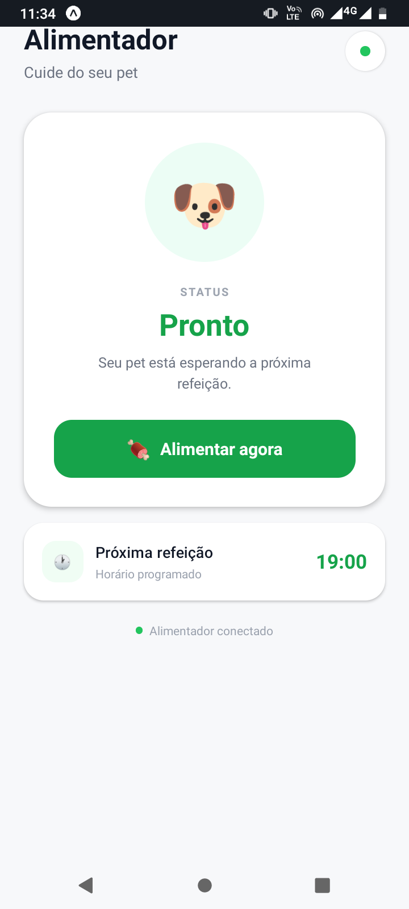
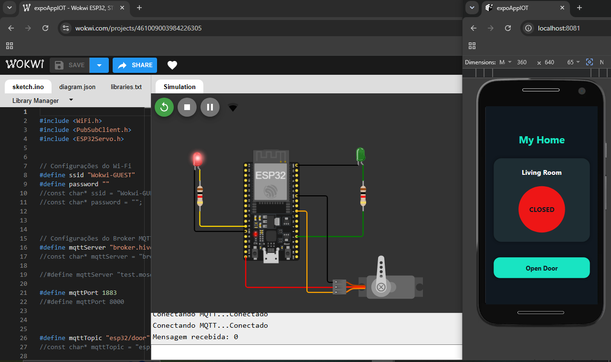
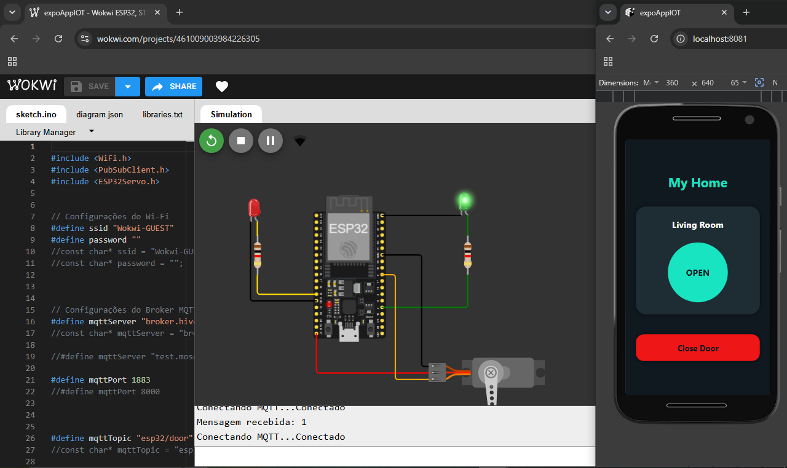

# 🏠 My Home - Sistema IoT de Controle de Porta e Alimentador automático com ESP32, MQTT e React Native


Projeto desenvolvido para demonstrar a comunicação entre um aplicativo **React Native** e um **ESP32** utilizando o protocolo **MQTT**.

O aplicativo permite controlar uma porta remotamente através de comandos enviados para um broker MQTT. O ESP32 recebe essas mensagens, controla um **servo motor** responsável pela abertura e fechamento da porta e atualiza LEDs indicadores de estado.

O sistema utiliza comunicação em tempo real através de MQTT, simulando uma aplicação de **Internet das Coisas (IoT)**.

---

# 📑 Índice

* Sobre o projeto
* Funcionalidades
* Tecnologias utilizadas
* Arquitetura do sistema
* Demonstração
* Simulação no Wokwi
* Capturas de tela
* Estrutura do projeto
* Instalação
* Configuração MQTT
* Como executar
* Melhorias futuras
* Autor
* Licença

---

# 📖 Sobre o Projeto

📖 Sobre o Projeto

Este projeto reúne duas aplicações de Internet das Coisas (IoT) desenvolvidas utilizando ESP32, MQTT, React Native e Wokwi, demonstrando diferentes possibilidades de integração entre software e hardware.

O primeiro projeto consiste em um sistema de controle de porta, no qual um aplicativo React Native envia comandos através do protocolo MQTT para um ESP32. O microcontrolador recebe os comandos e controla um servo motor responsável pela abertura e fechamento da porta, utilizando LEDs para indicar visualmente seu estado.

A partir dessa mesma arquitetura de comunicação, foi desenvolvido o segundo projeto, com foco em uma aplicação mais completa de automação: um alimentador automático para animais de estimação.

🐶 Alimentador Automático IoT

O alimentador automático é o principal projeto apresentado neste repositório.

A aplicação permite que o usuário controle remotamente a liberação de ração através de um aplicativo React Native. Ao pressionar o botão "Alimentar agora", o aplicativo envia o comando feed através do MQTT.

O ESP32 recebe esse comando e aciona um servo motor, responsável por abrir a comporta do alimentador durante um período determinado. Durante a alimentação, um LED é acionado para indicar que o processo está em andamento.

Além de receber comandos, o ESP32 também publica seu estado através do MQTT. Dessa forma, o aplicativo consegue acompanhar o funcionamento do alimentador em tempo real, exibindo estados como:

🟢 Pronto — o alimentador está disponível para uma nova alimentação;

🟡 Alimentando — a comporta está aberta e a ração está sendo liberada;

🔴 Desconectado — o aplicativo não está conectado ao sistema.

Essa segunda aplicação amplia a arquitetura utilizada no projeto de controle de porta, adicionando feedback de estado entre o dispositivo e o aplicativo, tornando a comunicação entre hardware e software mais completa.

🔗 Arquitetura em comum

Os dois projetos utilizam a mesma base tecnológica:

📱 Aplicativo React Native;

🌐 Broker MQTT HiveMQ;

🔌 ESP32;

📡 Comunicação MQTT;

⚙️ Servo motor;

💡 Indicadores visuais;

🖥️ Simulação através do Wokwi.

A diferença está na aplicação da tecnologia:

Projeto 1
Controle de Porta
      │
      ├── React Native
      ├── MQTT
      ├── ESP32
      ├── Servo
      └── LEDs


              ↓ evolução ↓


Projeto 2
Alimentador Automático
      │
      ├── React Native
      ├── MQTT
      ├── ESP32
      ├── Servo
      ├── LED
      ├── Controle de alimentação
      └── Feedback de estado em tempo real


O objetivo é demonstrar, através dos dois projetos, como uma mesma arquitetura de comunicação IoT pode ser aplicada a diferentes situações de automação, com ênfase no alimentador automático como evolução e aplicação principal do sistema.

---

# ✨ Funcionalidades

✨ Funcionalidades
🐶 Alimentador Automático IoT — Projeto Principal

✅ Controle remoto do alimentador através do aplicativo React Native;

✅ Comando de alimentação enviado via MQTT;

✅ Comunicação em tempo real entre aplicativo e ESP32;

✅ Acionamento do servo motor para abertura da comporta;

✅ Liberação automática da ração durante o período configurado;

✅ LED indicador durante o processo de alimentação;

✅ Publicação do estado do alimentador pelo ESP32;

✅ Atualização do aplicativo entre os estados Pronto e Alimentando;

✅ Indicador de conexão entre o aplicativo e o sistema;

✅ Bloqueio do botão durante o processo de alimentação;

✅ Reconexão do ESP32 ao broker MQTT;

✅ Simulação completa utilizando Wokwi.

🚪 Controle de Porta — Projeto Inicial

✅ Controle remoto da porta através do aplicativo React Native;

✅ Comunicação em tempo real utilizando MQTT;

✅ Envio de comandos para o ESP32;

✅ Controle de abertura e fechamento utilizando servo motor;

✅ Indicadores visuais através de LEDs:

🟢 LED verde quando a porta está aberta;

🔴 LED vermelho quando a porta está fechada;

✅ Interface mobile para controle do dispositivo;

✅ Simulação utilizando Wokwi.

🔗 Tecnologias em Comum

Os dois projetos utilizam a mesma base de desenvolvimento:

📱 React Native para a interface mobile;

🔌 ESP32 para controle do hardware;

🌐 HiveMQ como broker MQTT;

📡 MQTT para comunicação entre aplicativo e dispositivo;

⚙️ Servo motor para movimentação mecânica;

💡 LEDs para indicação visual;

🖥️ Wokwi para simulação do hardware.

---

# 🛠 Tecnologias Utilizadas

## 📱 Mobile

* React Native
* JavaScript
* MQTT.js

## 🔌 Hardware

* ESP32
* Servo Motor
* LED verde
* LED vermelho

## 📡 Comunicação

* MQTT
* WebSocket
* HiveMQ MQTT Broker

## 🖥 Simulação

* Wokwi

---

# 🏗 Arquitetura do Sistema


🏗 Arquitetura do Sistema

Os dois projetos utilizam uma arquitetura IoT baseada em React Native, MQTT e ESP32. O primeiro projeto utiliza essa estrutura para controlar uma porta, enquanto o segundo aplica a mesma tecnologia em um alimentador automático para pets, adicionando comunicação de estado em tempo real.

                         📱 React Native
                               │
                               │ MQTT / WebSocket
                               ▼
                      🌐 Broker HiveMQ
                               │
                               │ MQTT
                               ▼
                            🔌 ESP32
                               │
                    ┌──────────┴──────────┐
                    │                     │
                    ▼                     ▼
              ⚙️ Servo Motor          💡 LED
                    │                     │
          ┌─────────┴─────────┐           │
          │                   │           │
          ▼                   ▼           ▼
     🚪 Controle         🐶 Alimentador  Status
       de Porta             Automático
          │                   │
          ▼                   ▼
     Abre / Fecha       Libera a ração

🚪 Projeto 1 — Controle de Porta
React Native
      │
      │ comando MQTT
      ▼
HiveMQ
      │
      ▼
ESP32
      │
      ├──► Servo Motor
      │       │
      │       └──► Abre / Fecha porta
      │
      └──► LEDs
              ├── 🟢 Porta aberta
              └── 🔴 Porta fechada

🐶 Projeto 2 — Alimentador Automático

O alimentador utiliza a mesma arquitetura, porém possui um fluxo de comunicação mais completo, pois o ESP32 também publica o estado do dispositivo de volta para o aplicativo.

                    📱 React Native
                         │
                         │ "feed"
                         ▼
                  🌐 HiveMQ Broker
                         │
                         │ esp32/feeder/set
                         ▼
                      🔌 ESP32
                         │
                  ┌──────┴──────┐
                  ▼             ▼
             ⚙️ Servo        💡 LED
                  │             │
                  ▼             ▼
             Comporta       Alimentando
                  │
                  ▼
             🥣 Libera ração
                  │
                  │
                  ▼
             ESP32 publica
                  │
          ┌───────┴────────┐
          ▼                ▼
      "feeding"          "ready"
          │                │
          └───────┬────────┘
                  ▼
             📱 React Native
             atualiza status

---             

🔄 Fluxo do Alimentador
Usuário
   │
   ▼
"Alimentar agora"
   │
   ▼
MQTT: "feed"
   │
   ▼
ESP32
   │
   ├──► Publica "feeding"
   ├──► Liga LED
   └──► Abre servo
            │
            ▼
       Libera ração
            │
            ▼
       Fecha servo
            │
            ├──► Desliga LED
            └──► Publica "ready"
                         │
                         ▼
                    Aplicativo
                         │
                         ▼
                      "Pronto"


Essa arquitetura demonstra a evolução do projeto inicial de controle de porta para uma aplicação de automação mais completa, utilizando o MQTT não apenas para enviar comandos ao ESP32, mas também para retornar informações de estado ao aplicativo.

---

🔄 Fluxo da Aplicação

Os projetos utilizam um fluxo baseado em React Native → MQTT → ESP32, com o alimentador automático acrescentando o retorno do estado do dispositivo para o aplicativo.

🚪 Projeto 1 — Controle de Porta

O usuário pressiona o botão no aplicativo.

O aplicativo publica um comando MQTT.

O broker HiveMQ recebe a mensagem.

O ESP32 recebe o comando através da assinatura MQTT.

O ESP32 aciona o servo motor.

O servo realiza a abertura ou fechamento da porta.

Os LEDs são atualizados conforme o estado da porta.

React Native
     │
     │ comando MQTT
     ▼
HiveMQ
     │
     ▼
ESP32
     │
     ├──► Servo → Porta
     │
     └──► LEDs → Estado

🐶 Projeto 2 — Alimentador Automático

O usuário pressiona "Alimentar agora" no aplicativo.

O React Native publica o comando feed no tópico esp32/feeder/set.

O broker HiveMQ encaminha a mensagem para o ESP32.

O ESP32 recebe o comando através da assinatura MQTT.

O ESP32 publica o estado feeding.

O aplicativo recebe o estado e exibe "Alimentando".

O servo motor é movimentado para abrir a comporta.

O LED é ligado durante a liberação da ração.

Após o tempo configurado, o servo retorna à posição fechada.

O LED é desligado.

O ESP32 publica o estado ready.

O aplicativo recebe o novo estado e retorna para "Pronto".

Usuário
   │
   ▼
"Alimentar agora"
   │
   │ feed
   ▼
React Native
   │
   │ MQTT / WebSocket
   ▼
HiveMQ
   │
   │ MQTT
   ▼
ESP32
   │
   ├──► "feeding"
   │
   ├──► Servo abre
   │
   ├──► LED ON
   │
   ├──► Libera ração
   │
   ├──► Servo fecha
   │
   ├──► LED OFF
   │
   └──► "ready"
            │
            ▼
       React Native
            │
            ▼
         "Pronto"

---        

🔁 Comunicação bidirecional

No projeto do alimentador, a comunicação ocorre nos dois sentidos:

              📱 React Native
                    │
                    │ "feed"
                    ▼
              🌐 HiveMQ
                    │
                    ▼
                 🔌 ESP32
                    │
                    │ "feeding"
                    │ "ready"
                    ▼
              🌐 HiveMQ
                    │
                    ▼
              📱 React Native


Essa comunicação permite que o aplicativo não apenas envie o comando para alimentar, mas também acompanhe o estado real do processo, proporcionando um feedback em tempo real ao usuário.


---

# 🎥 Demonstração

Veja o projeto funcionando:

▶️ https://youtu.be/4aEeqXv4Xjc

O vídeo apresenta:

* 📱 Conexão do aplicativo com o broker MQTT;
* 📡 Comunicação MQTT em tempo real;
* 🚪 Abertura e fechamento da porta;
* 🟢 Acionamento do LED verde quando a porta está aberta;
* 🔴 Acionamento do LED vermelho quando a porta está fechada;
* 🔄 Atualização do status na interface mobile.

---

# 💻 Simulação no Wokwi

A simulação do ESP32 pode ser executada diretamente no navegador:

🔗 https://wokwi.com/projects/461009003984226305

O ambiente permite testar a lógica do ESP32, o servo motor e os LEDs indicadores sem necessidade do hardware físico.

---


🟢 Alimentador Pronto

Estado em que o alimentador está disponível para uma nova alimentação:

🟢 Status: Pronto;

🐶 Indicador do pet;

🍖 Botão "Alimentar agora" disponível;

💡 LED do ESP32 desligado;

⚙️ Servo motor na posição fechada.

🟡 Alimentando

Estado apresentado durante a liberação da ração:

🟡 Status: Alimentando;

📝 Mensagem "Liberando a ração...";

🍖 Botão alterado para "Liberando...";

🔒 Botão temporariamente desabilitado;

💡 LED do ESP32 ligado;

⚙️ Servo motor acionando a comporta.

Após o término do processo, o ESP32 fecha a comporta, desliga o LED e publica o estado ready.

🚪 Controle de Porta
O primeiro projeto utiliza a mesma base de comunicação MQTT para controlar uma porta através do ESP32.

---

🔒 Porta Fechada

Estado inicial do sistema:

🔴 Status: CLOSED;

🔴 LED vermelho ligado no ESP32;

🚪 Porta fechada;

🔘 Botão disponível para abrir.

🔓 Porta Aberta

Estado após o envio do comando MQTT:

🟢 Status: OPEN;

🟢 LED verde ligado no ESP32;

⚙️ Servo motor movimentado;

🔘 Botão disponível para fechar. 

---

# 📁 Estrutura do Projeto

EXPOAPPIOT/
│
├── docs/
│   │
│   ├── images/
│   │   ├── home-screen.png
│   │   │
│   │   ├── feeder-ready.png
│   │   ├── feeder-feeding.png
│   │   │
│   │   ├── door-open.png
│   │   └── door-closed.png
│   │
│   └── wokwi/
│       │
│       ├── diagram.json
│       ├── libraries.txt
│       ├── sketch.ino
│       └── wokwi-project.txt
│
├── src/
│   └── index.jsx
│
├── App.js
├── package.json
└── README.md

---

# ⚙️ Instalação

Clone o repositório:

```bash
git clone https://github.com/RonaldoFagundes/expoAppIOT.git 
         
```  

Acesse a pasta:

```bash
cd expoAppIOT
```

Instale as dependências:

```bash
npm install
```

ou:

```bash
yarn
```

---

# 📡 Configuração MQTT

O projeto utiliza o broker público HiveMQ.

Configuração do ESP32:

```text
Broker:
broker.hivemq.com

Porta:
1883

Protocolo:
MQTT TCP

Tópico:
esp32/door
```

Configuração do React Native:

```text
Broker:
broker.hivemq.com

Porta:
8000

Protocolo:
MQTT WebSocket

Tópico:
esp32/door
```

O ESP32 e o aplicativo devem utilizar o mesmo tópico MQTT para comunicação.

---

# ▶️ Executando o Projeto

## Aplicativo React Native

Execute:

```bash
npx react-native run-android
```

ou:

```bash
npx react-native run-ios
```

---

## ESP32

1. Configure a rede Wi-Fi;
2. Grave o código no ESP32;
3. Aguarde a conexão com o broker MQTT;
4. Utilize o aplicativo para enviar os comandos.

---

# 🚀 Melhorias Futuras

* Publicação do estado da porta pelo ESP32 para o aplicativo;
* Histórico de abertura e fechamento;
* Controle de múltiplas portas;
* Sensor físico de porta aberta/fechada (reed switch);
* Notificações Push;
* Dashboard Web;
* Autenticação de usuários;
* Criptografia MQTT.

---

# 👨‍💻 RonaldoFagundes

Projeto desenvolvido como estudo de **Internet das Coisas (IoT)**, utilizando React Native, ESP32 e MQTT para demonstrar comunicação entre software e hardware em tempo real.

---

# 📄 Licença

Este projeto está licenciado sob a licença MIT.

Sinta-se à vontade para estudar, modificar e contribuir com melhorias.
