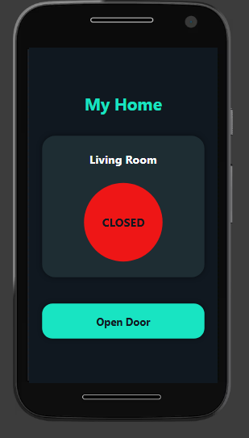
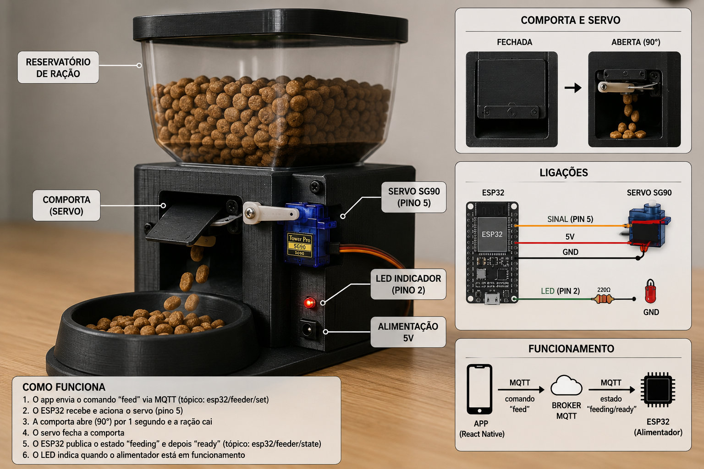

# 🏠 My Home - Sistema IoT de Controle de Porta e Alimentador automático com ESP32, MQTT e React Native


Projeto desenvolvido para demonstrar a integração entre React Native, ESP32, MQTT, HiveMQ e Wokwi em aplicações de Internet das Coisas (IoT).

O projeto reúne duas aplicações baseadas na mesma arquitetura de comunicação:

🚪 Controle de Porta IoT — abertura e fechamento remoto de uma porta.

🐶 Alimentador Automático IoT — controle remoto da liberação de ração para animais de estimação.

A comunicação entre o aplicativo e o ESP32 é realizada utilizando o protocolo MQTT, através do broker HiveMQ.

O ESP32 recebe os comandos enviados pelo aplicativo, controla os atuadores e, no caso do alimentador automático, também publica informações de estado para o aplicativo.


## 📑 Índice

📖 Sobre o Projeto

🚪 Projeto 1 — Controle de Porta

🐶 Projeto 2 — Alimentador Automático

🔗 Arquitetura em Comum

✨ Funcionalidades

🛠 Tecnologias Utilizadas

🏗 Arquitetura do Sistema

🔄 Fluxo da Aplicação

🔁 Comunicação Bidirecional

🎥 Demonstração

💻 Simulação no Wokwi

📸 Capturas de Tela

📁 Estrutura do Projeto

⚙️ Instalação

📡 Configuração MQTT

▶️ Executando o Projeto

🚀 Melhorias Futuras

👨‍💻 Autor

📄 Licença

## 📖 Sobre o Projeto

Este projeto reúne duas aplicações de Internet das Coisas (IoT) desenvolvidas utilizando:

React Native

ESP32

MQTT

HiveMQ

Wokwi

Servo Motor

LEDs

A proposta é demonstrar como uma mesma arquitetura de comunicação pode ser utilizada em diferentes aplicações de automação.

O primeiro projeto foi desenvolvido para controlar uma porta remotamente. A partir dessa arquitetura, foi desenvolvido um segundo projeto com uma aplicação de automação mais completa: um alimentador automático para animais de estimação.


🏗️ Arquitetura básica

```      
📱 React Native
       │
       │ MQTT / WebSocket
       ▼
🌐 HiveMQ MQTT Broker
       │
       │ MQTT
       ▼
🔌 ESP32
       │
       ├──► ⚙️ Servo Motor
       │
       └──► 💡 LEDs
```

No alimentador automático, a comunicação também permite o retorno de informações do ESP32 para o aplicativo:

```
📱 React Native
       │
       │ Comando
       ▼
🌐 HiveMQ
       │
       ▼
🔌 ESP32
       │
       │ Estado
       ▼
🌐 HiveMQ
       │
       ▼
📱 React Native
```

Dessa forma, o sistema trabalha tanto com envio de comandos quanto com feedback de estado em tempo real.

### 🚪 Projeto 1 — Controle de Porta

O primeiro projeto consiste em um sistema IoT para controle remoto de uma porta.

O usuário utiliza o aplicativo React Native para enviar comandos através do protocolo MQTT.

O broker HiveMQ recebe as mensagens e encaminha os comandos para o ESP32.

O ESP32 interpreta os comandos e controla um servo motor, responsável pela movimentação da porta.

LEDs são utilizados para indicar visualmente o estado atual da porta.

Estados da porta

🟢 OPEN — porta aberta.

🔴 CLOSED — porta fechada.

Fluxo

```
📱 React Native
       │
       │ Comando MQTT
       ▼
🌐 HiveMQ
       │
       │ MQTT
       ▼
🔌 ESP32
       │
       ├──► ⚙️ Servo Motor
       │        │
       │        └──► Abre / Fecha porta
       │
       └──► 💡 LEDs
                ├── 🟢 Porta aberta
                └── 🔴 Porta fechada
```  

### 🐶 Projeto 2 — Alimentador Automático

O alimentador automático é uma evolução da arquitetura utilizada no projeto de controle de porta.

O sistema permite que o usuário controle remotamente a liberação de ração através de um aplicativo React Native.

Ao pressionar o botão "Alimentar agora", o aplicativo publica o comando feed no broker MQTT.

O ESP32 recebe esse comando e aciona um servo motor responsável pela abertura da comporta do alimentador.

Durante o processo de alimentação, um LED é acionado para indicar que a operação está em andamento.

Após o período configurado:

O servo retorna à posição fechada.

O LED é desligado.

O ESP32 publica o estado ready.

O aplicativo atualiza a interface.

Estados do alimentador

🟢 ready	Alimentador disponível para uma nova alimentação

🟡 feeding	Alimentador liberando ração

🔴 Desconectado	Aplicativo ou dispositivo não conectado

Fluxo

```
📱 React Native
       │
       │ feed
       ▼
🌐 HiveMQ Broker
       │
       │ esp32/feeder/set
       ▼
🔌 ESP32
       │
       ├──► ⚙️ Servo
       │       │
       │       └──► Abre comporta
       │
       └──► 💡 LED
               │
               └──► Alimentando
                       │
                       ▼
                  🥣 Libera ração
                       │
                       ▼
                  Fecha comporta
                       │
                       ▼
                  Publica ready
                       │
                       ▼
                📱 React Native
```

#### 🔗 Arquitetura em Comum

Os dois projetos utilizam a mesma base tecnológica:

📱 React Native

🔌 ESP32

🌐 HiveMQ MQTT Broker

📡 MQTT

⚙️ Servo Motor

💡 LEDs

🖥️ Wokwi

A evolução do projeto pode ser representada da seguinte forma:

```
┌───────────────────────────────┐
│ 🚪 Projeto 1                  │
│ Controle de Porta             │
├───────────────────────────────┤
│ • React Native                │
│ • MQTT                        │
│ • ESP32                       │
│ • Servo Motor                 │
│ • LEDs                        │
└───────────────┬───────────────┘
                │
                │ Evolução
                ▼
┌───────────────────────────────┐
│ 🐶 Projeto 2                  │
│ Alimentador Automático        │
├───────────────────────────────┤
│ • React Native                │
│ • MQTT                        │
│ • ESP32                       │
│ • Servo Motor                 │
│ • LED                         │
│ • Controle de alimentação     │
│ • Feedback de estado          │
└───────────────────────────────┘
```

## ✨ Funcionalidades

### 🐶 Alimentador Automático

✅ Controle remoto do alimentador através do aplicativo React Native.

✅ Envio do comando feed via MQTT.

✅ Comunicação em tempo real entre aplicativo e ESP32.

✅ Acionamento do servo motor.

✅ Abertura automática da comporta.

✅ Liberação da ração durante o período configurado.

✅ LED indicador durante a alimentação.

✅ Publicação do estado do alimentador pelo ESP32.

✅ Atualização da interface entre Pronto e Alimentando.

✅ Indicador de conexão.

✅ Bloqueio do botão durante a alimentação.

✅ Reconexão do ESP32 ao broker MQTT.

✅ Simulação utilizando Wokwi.

### 🚪 Controle de Porta

✅ Controle remoto da porta.

✅ Comunicação MQTT em tempo real.

✅ Envio de comandos para o ESP32.

✅ Controle de abertura e fechamento através de servo motor.

✅ LED verde para indicar porta aberta.

✅ LED vermelho para indicar porta fechada.

✅ Interface mobile.

✅ Simulação utilizando Wokwi.

#### 🛠 Tecnologias Utilizadas

📱 Mobile<br>
React Native<br>
JavaScript ES6<br>
MQTT.js<br>

🔌 Hardware<br>
ESP32<br>
Servo Motor<br>
LED verde<br>
LED vermelho<br>

📡 Comunicação<br>
MQTT<br>
MQTT sobre WebSocket<br>
HiveMQ MQTT Broker<br>

🖥️ Simulação<br>
Wokwi

#### 🏗 Arquitetura do Sistema

A arquitetura geral do projeto pode ser representada da seguinte maneira:

```

                         📱 React Native
                                │
                                │ MQTT / WebSocket
                                ▼
                       🌐 HiveMQ Broker
                                │
                                │ MQTT
                                ▼
                             🔌 ESP32
                                │
                     ┌──────────┴──────────┐
                     │                     │
                     ▼                     ▼
               ⚙️ Servo Motor          💡 LED
                     │                     │
              ┌──────┴──────┐              │
              │             │              │
              ▼             ▼              ▼
         🚪 Controle   🐶 Alimentador    Status
           de Porta       Automático
              │             │
              ▼             ▼
         Abre/Fecha     Libera Ração
```        

### 🔄 Fluxo da Aplicação

#### 🚪 Controle de Porta

O funcionamento ocorre da seguinte forma:

O usuário pressiona o botão no aplicativo.

O aplicativo publica um comando MQTT.

O broker HiveMQ recebe a mensagem.

O ESP32 recebe o comando.

O ESP32 aciona o servo motor.

O servo realiza a abertura ou fechamento.

Os LEDs são atualizados conforme o estado da porta.

```
Usuário
   │
   ▼
📱 React Native
   │
   │ Comando MQTT
   ▼
🌐 HiveMQ
   │
   ▼
🔌 ESP32
   │
   ├──► ⚙️ Servo → Porta
   │
   └──► 💡 LEDs → Estado
```

#### 🐶 Alimentador Automático

O fluxo do alimentador é composto pelas seguintes etapas:

O usuário pressiona "Alimentar agora".

O React Native publica o comando feed.

O comando é enviado para esp32/feeder/set.

O broker HiveMQ encaminha a mensagem para o ESP32.

O ESP32 recebe o comando.

O ESP32 publica o estado feeding.

O aplicativo exibe "Alimentando".

O servo abre a comporta.

O LED é ligado.

A ração é liberada.

O servo retorna para a posição fechada.

O LED é desligado.

O ESP32 publica o estado ready.

O aplicativo recebe o novo estado.

A interface retorna para "Pronto".

```
Usuário
   │
   ▼
"Alimentar agora"
   │
   │ feed
   ▼
📱 React Native
   │
   │ MQTT / WebSocket
   ▼
🌐 HiveMQ
   │
   │ MQTT
   ▼
🔌 ESP32
   │
   ├──► "feeding"
   │
   ├──► Servo abre
   │
   ├──► LED ON
   │
   ├──► Libera ração
   │
   ├──► Servo fecha
   │
   ├──► LED OFF
   │
   └──► "ready"
            │
            ▼
       📱 React Native
            │
            ▼
         "Pronto"
```

🔁 Comunicação Bidirecional

No alimentador automático, a comunicação ocorre em ambos os sentidos.

Aplicativo → ESP32

O aplicativo envia o comando:

feed

ESP32 → Aplicativo

O ESP32 publica os estados:

feeding

ready

Representação

```
              📱 React Native
                    │
                    │ "feed"
                    ▼
              🌐 HiveMQ
                    │
                    ▼
                 🔌 ESP32
                    │
                    │ "feeding"
                    │ "ready"
                    ▼
              🌐 HiveMQ
                    │
                    ▼
              📱 React Native
```

Essa comunicação permite que o aplicativo envie comandos e acompanhe o estado do dispositivo em tempo real.

🎥 Demonstração

Veja o projeto funcionando:

▶️ Assistir demonstração no YouTube 

https://youtu.be/4aEeqXv4Xjc

O vídeo apresenta:

📱 Conexão do aplicativo com o broker MQTT.

📡 Comunicação MQTT em tempo real.

🚪 Abertura e fechamento da porta.

🟢 Acionamento do LED verde quando a porta está aberta.

🔴 Acionamento do LED vermelho quando a porta está fechada.

🔄 Atualização do status na interface mobile.

💻 Simulação no Wokwi

A simulação do ESP32 pode ser executada diretamente no navegador:

🔗 Abrir projeto no Wokwi

O ambiente permite testar a lógica do ESP32, o servo motor e os LEDs indicadores sem necessidade do hardware físico.


#### 📸 Capturas de Tela e Protótipo<br>
Confira abaixo algumas telas do aplicativo e imagens do protótipo desenvolvido.

🚪 Porta Fechada<br>	


🚪 Porta Aberta<br>


🐶 Alimentador Automático<br>
<br>

Tela inicial do aplicativo<br>


🔌 Protótipo<br>
<strong>Protótipo físico do sistema IoT</strong><br>
<p align="center"></p><br>

#### 🐶 Alimentador 

Pronto - Estado em que o alimentador está disponível para uma nova alimentação.<br>
🟢 Status: Pronto<br>
🐶 Indicador do pet<br>
🍖 Botão "Alimentar agora" disponível<br>
💡 LED do ESP32 desligado<br>
⚙️ Servo motor na posição fechada<br>
🐶 Alimentador — Alimentando<br>

Estado apresentado durante a liberação da ração.<br>
🟡 Status: Alimentando<br>
📝 Mensagem "Liberando a ração..."<br>
🍖 Botão alterado para "Liberando..."<br>
🔒 Botão temporariamente desabilitado<br>
💡 LED do ESP32 ligado<br>
⚙️ Servo motor acionando a comporta<br>
Após o término do processo, o ESP32 fecha a comporta, desliga o LED e publica o estado ready.

#### 🚪 Controle de Porta — Fechada

Estado inicial do sistema:<br>
🔴 Status: CLOSED<br>
🔴 LED vermelho ligado no ESP32<br>

🚪 Porta fechada<br>

🔘 Botão disponível para abrir<br>


🚪 Controle de Porta — Aberta<br>

Estado após o envio do comando MQTT:

🟢 Status: OPEN

🟢 LED verde ligado no ESP32

⚙️ Servo motor movimentado

🔘 Botão disponível para fechar


📁 Estrutura do Projeto

```
expoAppIOT/
│
├── docs/
│   ├── images/
│   │   ├── home-screen.png
│   │   ├── feeder-ready.png
│   │   ├── feeder-feeding.png
│   │   ├── door-open.png
│   │   ├── door-closed.png
│   │   └── prototipo.png
│   │
│   └── wokwi/
│       ├── diagram.json
│       ├── libraries.txt
│       ├── sketch.ino
│       └── wokwi-project.txt
│
├── src/
│   └── index.jsx
│
├── App.js
├── package.json
└── README.md
```

#### ⚙️ Instalação

1. Clone o repositório<br>
git clone https://github.com/RonaldoFagundes/expoAppIOT.git

2. Acesse a pasta<br>
cd expoAppIOT

3. Instale as dependências

Com npm:<br>
npm install

Ou utilizando Yarn:<br>
yarn

📡 Configuração MQTT

O projeto utiliza o broker público HiveMQ.

⚠️ Para aplicações reais, recomenda-se utilizar autenticação e comunicação MQTT segura (TLS), evitando o uso de credenciais e dados sensíveis em código público.

🔌 ESP32<br>
Broker:<br>
broker.hivemq.com<br>

Porta:<br>
1883

Protocolo:<br>
MQTT TCP

Tópico:<br>
esp32/door

📱 React Native

Broker:<br>
broker.hivemq.com

Porta:<br>
8000

Protocolo:<br>
MQTT WebSocket

Tópico:<br>
esp32/door

O ESP32 e o aplicativo devem utilizar o mesmo tópico MQTT para comunicação.

▶️ Executando o Projeto

📱 Aplicativo React Native

Execute:

npx react-native run-android

Ou:

npx react-native run-ios

🔌 ESP32

Configure a rede Wi-Fi.

Configure o broker MQTT.

Grave o código no ESP32.

Aguarde a conexão com o broker MQTT.

Abra o aplicativo React Native.

Utilize o aplicativo para enviar os comandos.

Observe a resposta do ESP32 e os atuadores.


### 💻 Simulação no Wokwi
A simulação do ESP32 pode ser executada diretamente no navegador:

🔗 https://wokwi.com/projects/461009003984226305

O ambiente permite testar a lógica do ESP32, o servo motor e os LEDs indicadores sem necessidade do hardware físico.

🚀 Melhorias Futuras

Algumas melhorias planejadas para futuras versões:

📡 Publicação do estado da porta pelo ESP32 para o aplicativo.

📋 Histórico de abertura e fechamento.

🚪 Controle de múltiplas portas.

🔘 Sensor físico de porta aberta/fechada utilizando Reed Switch.

🔔 Notificações Push.

📊 Dashboard Web.

👤 Autenticação de usuários.

🔐 Criptografia MQTT utilizando TLS.

🐶 Configuração de horários automáticos para alimentação.

🍖 Controle da quantidade de ração liberada.

📈 Histórico de alimentações.

👨‍💻 Autor <br>
RonaldoFagundes

Projeto desenvolvido como estudo de Internet das Coisas (IoT), utilizando React Native, ESP32 e MQTT para demonstrar a comunicação entre software e hardware em tempo real.

📄 Licença<br>
Este projeto está licenciado sob a MIT License.

Você pode estudar, modificar e contribuir com melhorias para o projeto.


